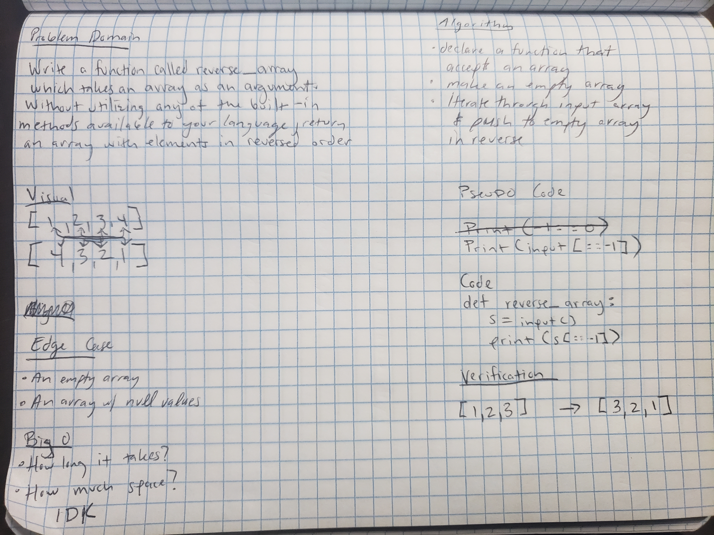

# Table of Contents

## Reverse Array
* Reverses an array without using built in methods of Python. Worked on this with Joseph Lee.

## Approach and Efficiency
* Take the input and reverse it using slice

## Solution
* Slice and print using index values

