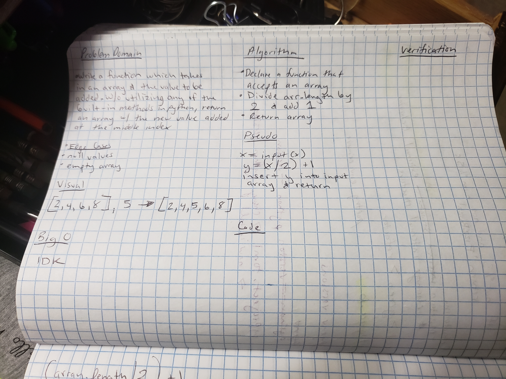
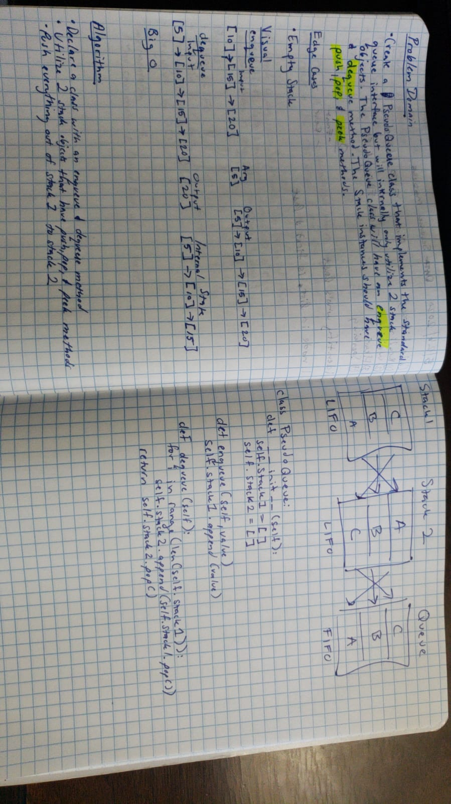

# Table of Contents

## Reverse Array
* Reverses an array without using built in methods of Python. Worked on this with Joseph Lee.

## Approach and Efficiency
* Take the input and reverse it using slice

## Solution
* Slice and print using index values

## Array Shift
* Takes an array and a value to be added to the array. The value should be added to the middle of the array.

## Approach and Efficiency
* I haven't solved it, yet. I think we have to take the length of the array, divide it by 2, and add 1. Then use that value as index value to insert the supplied integer to be added to the array

## Solution
* pending

## Array Binary Search
* Create a function with two parameters: a sorted list and a search key. Return the index of the search key or -1 if the search key is not in the sorted list.

## Approach and Efficiency
* I haven't solved it, yet.

## Solution
* pending

## Array Matrix
* Create a functionto add up the sum of each row in a matrix of arbitrary size and return an array with the appropriate values.

## Approach and Efficiency
* My approach is to loop through the main array and then loop through the row, summing the numbers as the function loops. After looping through the matrix, push the sums to a new array that then print out the appropriate values.

## Solution
* pending

# Singly Linked List
## Challenge
* Create a linked list with various methods: insert, includes, and `__str__`.
## Approach and Efficiency
* I used various online resources and the class demo to stitch something together. It still needs work.
## API
* [Includes method documentation!](https://www.geeksforgeeks.org/search-an-element-in-a-linked-list-iterative-and-recursive/)
* [Understanding F strings!](https://realpython.com/python-f-strings/)
* [Creating Linked Lists in Python!](https://www.educative.io/edpresso/how-to-create-a-linked-list-in-python)
* [Showing Curly Braces inside Curly Braces Explanation!](https://stackoverflow.com/questions/5466451/how-can-i-print-literal-curly-brace-characters-in-python-string-and-also-use-fo)

# Linked List Insertions
## Challenge
* Create a three methods: one that appends to the end of a list, one that inserts before a node, and one that inserts after a node.
## Approach and Efficiency
* I used various online resources and the class demo to stitch something together. It still needs work. Specifically, the insert before method.
## API
* [Methods for insert after and append](https://www.geeksforgeeks.org/linked-list-set-2-inserting-a-node/)

# Linked List Insertions
## Challenge
* Create a method that prints the node that is k indices from the end where k is a parameter passed into the function.
## Approach and Efficiency
* It has one for loop which means it is O(n). The solution is based heavily on a resource I found online, I did not copy/paste and I'm doing my best to understand it.
## API
* [Method for find/print nth node from the end of a list](https://www.geeksforgeeks.org/nth-node-from-the-end-of-a-linked-list/)

# Linked List Merge
## Challenge
* Create a functino that merges two separate lists into one new list whcih alternates the nodes from the two lists into the new list
## Approach and efficiency
* It has one while loop which means it's efficiency is O(n).
## API
* [Geeks for Geeks Solution](https://www.geeksforgeeks.org/merge-a-linked-list-into-another-linked-list-at-alternate-positions/)

# Stack and Queue Implementation
## Challenge
* Create a stack class with push, pop, peek, and isEmpty methods. Create a queue class with enqueue, dequeue, peek, and isEmpty methods.
## Approach and efficiency
* O(1)
## API
* [Youtube Tutorial](https://www.youtube.com/watch?v=rQpP7CD6zqY&t=205s)

# Queue with Stacks

## Challenge
* Create a a queue using two stacks
## Approach and efficiency
* Push items out of list1 into list 2 using a last in first out approach. Then push items out of list into the queue that uses a first in first out approach.
## API
* [Youtube Tutorial](https://www.youtube.com/watch?v=jKGkphPsnSI)

# Fifo Animal Shelter

## Challenge Description
* Create a class called AnimalShelter which holds only dogs and cats. The shelter operates using a first-in, first-out approach. 
* Implement the following methods:
    * enqueue(animal): adds animal to the shelter. animal can be either a dog or a cat object.
    * dequeue(pref): returns either a dog or a cat. If pref is not "dog" or "cat" then return null

## Approach & Efficiency
* I have not solved it.
* I used previous code demos to build out the queue, stack, and node. I tried to build something for enqueue and dequeue

## Whiteboard
 

# Multi Bracket Validation

## Challenge Description
* Create a function that takes strings as its argument and should return a boolean representing whether or not the brakets in the string are balanced (), [], {}

## Approach & Efficiency
* [Reference Material](https://www.geeksforgeeks.org/check-for-balanced-parentheses-in-python/)
* The solution creates two lists that hold the bracket values we're checking
* In the function it creates an empty stack it appends to from the str parameter. It checks the input string against the two lists that hold bracket values. It then pops off matching pairs and returns true when the length of the list in the function is 0.
* Time O(n)
* space idk - o(n) ....it creates three lists

## Whiteboard
 